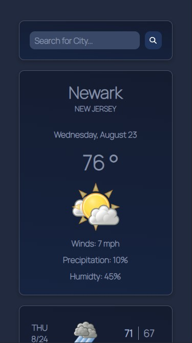
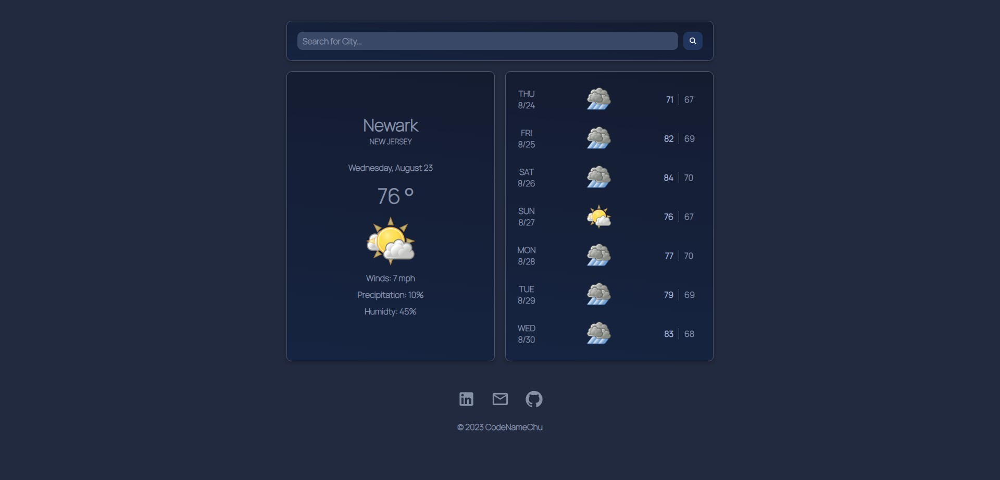

# Weather App

Hey, what's up! I wanted to create a practical project that my friends and I could use which would incorporate some of the concepts I have been learning. Specifically, I wanted to focus on interacting with an API and seeing how it can be used to give the website user the information they are looking for.

## Snapshots

| Mobile View 1 | Mobile View 2 |
|-------------|-------------|
|||

| Tablet View |
|-------------|
|  |

| Desktop View |
|--------------|
||

## Environmental Variables

To run this project, you will first need a .env file. Then you will need to add the following environment variable to your .env file:

`REACT_APP_API_KEY`

## Project Goals

- [x] Interact with an API
- [x] Utilize an organized file structure
- [x] Make page fully responsive
- [x] Allow weather to be searchable by city

### Future Plans

- [ ] Allow weather search to specify by city, state (& country)
- [ ] Fully refractor code so it runs as efficiently as possible
- [ ] Implement requested API info for better user experience
- [ ] Set default city to the city of user's current location

## Want to Contribute? 

(Fork &) Clone this repository.

```
git clone https://github.com/Chudii/weather-api.git
```
Go to the project directory
```
cd <project-name>
```
Then install the NPM packages
```
npm install
```
Use this command to create a new branch:
```
git checkout -b <insert-your-branch-name>
```
And don't forget after you've made any changes to...
```
git add .
git commit -m '<insert-commit-message>'
git push origin <insert-your-branch-name>
```
To Start Server:
```
npm run start
```

## Support

For support, email [chudiibida3@gmail.com](mailto:chudiibida3@gmail.com).

## Contact

[](https://www.linkedin.com/in/chudi-ibida/)

[](https://github.com/Chudii)

## About Me

I'm an aspiring software engineer, studying Full Stack web development and fundamental computer science principles. With the help of formal instruction and prior IT curriculums, I am mastering new technologies for technical skill building daily. Outside of coding, I love to create art, read informative literature, dance, and challenge my mind. 